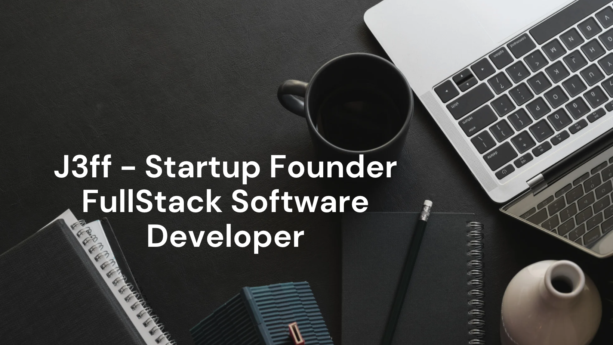

# Hi there 👋. I'm Jeff
 


## About me

```javascript
const aboutMe = {
   pronouns: "he" | "him",
   code: [HTML5, CSS3, JavaScript],
   technologies: {
      frontEnd: {
         js: ["React.js", "Redux"],
         css: ["Bootstrap", "Tailwind"]
      },
      backEnd: {         
         js: ["Node"],
         ruby: ["Rails"],         
      },
      databases: ["Postgres", "SQL"],      
   },
   currentOccupation: ["Microverse student", "Startup Founder"],   
};
```

Here are a few things about me:

- 🔭 I’m currently working on a FIntech Startup with [Blessed](https://github.com/blessedjasonmwanza) as my Co-Founder
- 🌱 I’m currently learning Ruby and Ruby on Rails
- 👯 I’m looking to collaborate on Javascript, React, and Redux projects
- 💬 Ask me about Startups, Sustainable Development, and Wildlife Conservation
- 📫 How to reach me: jeffkayombo16@gmail.com


## Languages used
<p align="start"></p>

## My GitHub stats
[](https://github.com/anuraghazra/github-readme-stats)