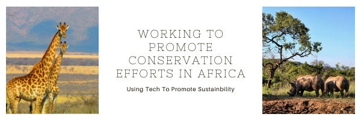

<p align="center"></p>

<h1 align="center">Hi, I am Jeff Kayombo</h1>

> ### <p align="center" width="150px">I am an enthusiastic and Full-stack whose passionate about the environment; climate change and wildlife conservation. I'm working to develop software products that will compliment conservation efforts in Eastern and Southern Africa. </p>


<h3> 👨🏻‍💻 &nbsp; About me:</h3> 

- 🔭 I am currently a full-time student at Microverse Inc.
- 🌱 I am currently learning Full-Stack Web Development ```(HTML, CSS, Ruby on Rails, JavaScript, and React)```, while aspiring to learn ```Python``` programming to its core and later C# & C++ for Game Development.
- 👯 I am looking forward to working with teams in building Business management systems, and viable software solutions.
- 💬 Ask me about anything; I am happy to help and learn from you.
- 📄 So far, and in addition to private projects (_that might not show up here_ 🤓), I co-founded [An Advanced loan automation cloud software from scratch]()
- 📄 Please have a look at my [Résumé]() for more details about me. I'm open to feedback and suggestions!

<br>
<br>

> ### 🤝🏻  &nbsp;Connect with me, I would love to build the future with you and your team.
<br>

<p align="center">
<a href="https://www.linkedin.com/in/jeff-kayombo-aa9758174/"></a>
<a href="mailto:jeffkayombo16@gmail.com"></a>
<a href="https://twitter.com/jeff_kayombo"></a>


</p>

---